*Notes on driving Fusion 360 with Claude through its MCP server, including the dead ends.*

---

## TL;DR

I designed a clamshell aluminum case for a Lily58 Pro split keyboard entirely through Fusion 360's MCP (Model Context Protocol) server, driving the modeling via natural-language instructions to Claude rather than clicking in the UI. The final design has a matte space-grey aluminum tub + bezel sandwich enclosing a 1.5 mm anodized switch plate, with 4 edge screws + 10 inner standoff screws (28 fasteners per build matches stock Lily58 hardware exactly). Both halves are parametrically mirrored.

This isn't a "how to use Fusion 360 MCP" tutorial. It's a record of the gotchas, dead ends, and design iterations I hit shipping a real project through it.

---

> **Disclaimer**: I have zero formal CAD experience or training. My background is hobbyist 3D printing — the kind where "design" means extruding a shape and filleting a corner in beginner-friendly tools. Everything I "know" about parametric CAD and Fusion's API was learned through this single project by reading Claude's outputs and pushing back when something looked wrong in screenshots. If something here sounds obvious to a trained mechanical engineer, that's why — and if something sounds suspicious, trust the engineer, not me.

---

## The Setup

Starting point:
- [Lily58 Pro](https://github.com/kata0510/Lily58/tree/58c649797c185b7b32b9928d4546665153cfacfd/Pro) PCB files in KiCad (`.kicad_pcb`)
- 4 SVG sketches already imported into Fusion (Edge.Cuts, F.Fab, F.Cu, drl_map), all locked as reference geometry
- Autodesk Fusion (build 2702.1.58)
- A vague desire to build a "premium" enclosed clamshell case in 3 mm aluminum

The MCP server gave Claude three tools: `fusion_mcp_read` (queries), `fusion_mcp_execute` (Python scripts via the Fusion API), and `fusion_mcp_update` (undo/redo). Every geometric operation went through Python.

The reason to have 4 reference sketches is that at the time of testing, Claude was making guesses on what the Lily58 case would look like: 


Zero-shot CAD generation still has a long way to go.

---

## Why SVG, Not DXF or DWG

Before any actual modeling started, I burned an evening trying to get the KiCad geometry into Fusion 360 through the "proper" CAD interchange formats. Every KiCad → Fusion guide online treats DXF as the default path. In my experience, that path is broken end-to-end.

**DXF from KiCad**: KiCad exports DXF directly from `File → Plot → Format: DXF`. The file is valid — I confirmed by dropping it into sharecad.org, which rendered the keyboard half outline cleanly. Fusion 360 disagreed. Every attempt to use `Insert → Insert DXF` produced a single popup:

> *Fails to insert this DXF file!*

No detail. No log line. Uploading the same DXF through the Data Panel produced an `errorReport.pdf` that also wouldn't say what the error was. I worked through every variable the dialog exposed:

- DXF plot mode: `Sketch` (lines only) and contours-on (filled outlines). Both failed.
- Insert Mode: `Single Sketch` and `One Sketch Per Layer`. Both failed.
- Target plane: XY, XZ, YZ. All failed.
- Document type: `Part Design` → `Hybrid Design` (Fusion's newer doc-type split). Still failed.
- Followed Autodesk's [own troubleshooting article](https://www.autodesk.com/support/technical/article/caas/sfdcarticles/sfdcarticles/Fails-to-insert-this-DXF-file-is-shown-in-Fusion-360.html) on graphics preferences. No change.

In my testing, Fusion's DXF importer rejected the KiCad-exported file silently with no useful diagnostic.

**DWG via conversion**: KiCad doesn't export DWG natively. I converted the DXF using cloudconvert.com to AutoCAD 2018 DWG and uploaded to Fusion's Data Panel. Cloud translation succeeded — thumbnail rendered, no errors — so the file itself was fine.

Fusion handles DWG through a completely separate pipeline from DXF, and that pipeline has been steadily locked down:

- `Insert → Insert DXF` doesn't accept `.dwg` extensions
- The Data Panel's right-click menu doesn't show **Insert into Current Design** for translated DWGs
- Drag-and-drop from Data Panel onto the canvas is silently rejected
- Double-clicking the thumbnail opens the file in Autodesk's web-based cloud viewer (read-only)
- `Insert → Derive` won't list the DWG as an available source

The Autodesk in-app assistant later confirmed the root cause: DWG import is not supported on the Fusion Personal license. That explains the wall of silent rejections.

At this point I already burn so much time just to import from dxf/dwg.

**SVG eventually worked**: KiCad exports SVG from the same Plot dialog. Fusion's `Insert → Insert SVG` is a different code path from Insert DXF — and that path accepted the file on the first try.

The cost was scale calibration. KiCad emits SVG with coordinates in pixels at an assumed 96 DPI baseline. Fusion's SVG importer reads those pixel values as if they were millimeters directly. So a 142.5 mm PCB outline came in at **37.7 mm**, requiring `Scale Plane = 3.7796` in the import dialog — which is exactly `96 / 25.4`, the 96-DPI-pixel-to-millimeter conversion.

Three of the four reference layers (Edge.Cuts, F.Fab, F.Cu) shared that `3.7796` factor and snapped to a common origin. The drill map was the outlier:

- **Different scale**: `3.4710` instead of `3.7796` — KiCad's drill map renderer uses a different DPI baseline than its PCB plot
- **Different origin**: needed manual translation to overlay the others, because the drill map SVG centers its drawing on the page rather than respecting PCB-absolute coordinates
- **Legend/notes** outside the PCB area that I deleted after import

The price of using SVG: every curve becomes a polyline approximation, including the smooth top arch of the PCB. 120 short line segments where there should be a handful of arcs. That choice compounds through the rest of this post — bridging gaps, fillets that don't apply to projected curves, offset operations that misbehave at degenerate spots.

If you're starting fresh, **avoid SVG if you have any alternative**. The polyline approximation problems compound through every later step in this post. A format that preserves true arcs and curves (rather than approximating them as line segments) would skip most of what comes next.

---

## Coordinate System Confusion — Right at the Start

The first major gotcha: **understanding what coordinate space everything lives in**.

The imported SVG sketches were "on the XZ plane" according to `referencePlane.name`, but `Sketch.boundingBox` returned coordinates that looked like XY space. After probing a specific line's `geometry` (sketch-local) vs `worldGeometry`:

```
sketch_local: (116.19, -136.48, 0)   # 2D sketch coords
world:        (116.19, 0, 136.48)    # 3D world coords
```

**The mapping turned out to be**:
- Sketch local X = world X
- Sketch local Y = **negative** world Z (the sign flip caught me later when picking pin/magnet directions)
- The PCB lay on the XZ plane (world Y=0), with "vertical" = world +Y

---

## Bridging 1 µm Gaps in Polyline-Approximated Outlines

The PCB Edge.Cuts from KiCad becomes 120 individual SketchLines in Fusion after SVG import. Sketches with 120 curves and 0 profiles = **the outline isn't closing**.

Probing endpoint coincidence (by SketchPoint identity, not position) revealed **4 orphan endpoints — 2 pairs separated by ~1 micron each**. SVG export precision loss.

```
Pair 1: (117.865, -135.513) and (117.865, -135.514)   - delta = 1 micron
Pair 2: (89.995, -119.992)  and (89.995, -119.991)    - delta = 1 micron
```

Agent tried `geometricConstraints.addCoincident()` — failed because projected curves are read-only ("VCS_SKETCH_SOLVING_FAILED"). Agent fell back to **adding tiny bridging SketchLines** between the orphan pairs. Profile count went from 5 (just the M2 hole circles) to 6 (now including the outline). That worked, but the tiny bridge segments would later trip up offset operations that ran through them.

None of this would have happened with a format that preserves exact coordinates. The 1 µm jitter is a pure SVG side effect — the source `.kicad_pcb` had exact endpoint coincidence.

---

## Switch Cutouts, and the One Rotated Thumb Key

I parsed `Lily58_Pro_TOP.kicad_pcb` for switch positions, grouping `gr_line` entries into connected components and filtering to ~14×14 mm bounding boxes. Got **28 axis-aligned cutouts** plus **1 oddball with 19.125 × 19.124 mm bounding box** at the thumb cluster.

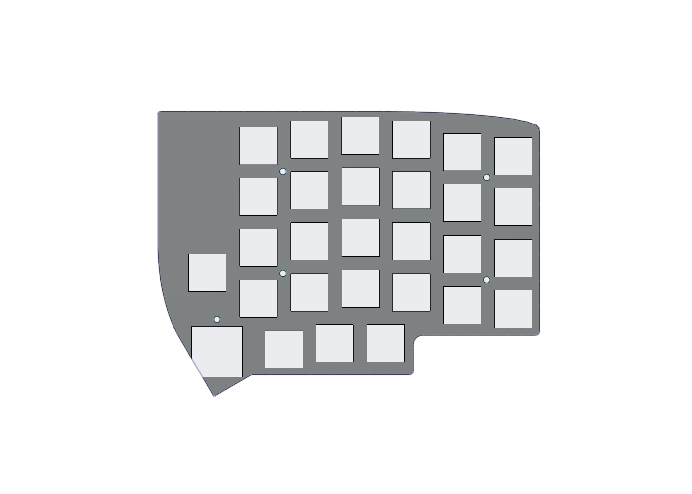

Agent initial conclusion: "That's the rotary encoder slot — 19 mm round cutout to accommodate the encoder OR a switch with a gap." Spent 30 minutes designing around a 19 mm encoder cutout.

My response after seeing it:
> "You got the rotation wrong on the bottom left hole. The original top case hole is tilted about 40 degree ccw."

**It wasn't an encoder. It was a 14×14 mm switch cutout rotated 60° (which gives a bounding box of `14 × (cos60° + sin60°) = 19.12 mm`)**, exactly matching the parser output. The thumb cluster has one switch tilted to match natural thumb reach.

Agent refactored: instead of parsing bounding boxes, **copy the exact line geometry from the source `.kicad_pcb`** for every cutout. Axis-aligned ones stayed axis-aligned, the rotated one got rotated correctly automatically.

---

## Architectural Evolution: Sandwich → Clamshell → Bezel

The case went through three major architectural revisions:

### v1: Stock-style sandwich
Two flat plates, open sides. My feedback after seeing it: *"the sandwich case is almost exactly like the stock plate which is the reason why this project started."*

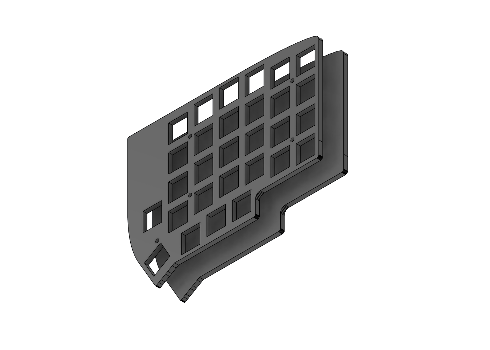

### v2: Clamshell with walls
Top + bottom plates each grew walls extending toward the middle, meeting at a seam. Geometric reality: **walls have to live somewhere, and they can't intrude into the PCB area**. So the entire case outline grew outward by `wall_thickness + pcb_clearance` = 3.5 mm relative to the PCB outline.

Agent used `Sketch.offset()` to create the expanded outline. Result: mostly clean, but with **two wandering offset curves that went to Y=−287** because the 1 µm bridge lines Agent added earlier created degenerate geometry that the offset algorithm couldn't handle.

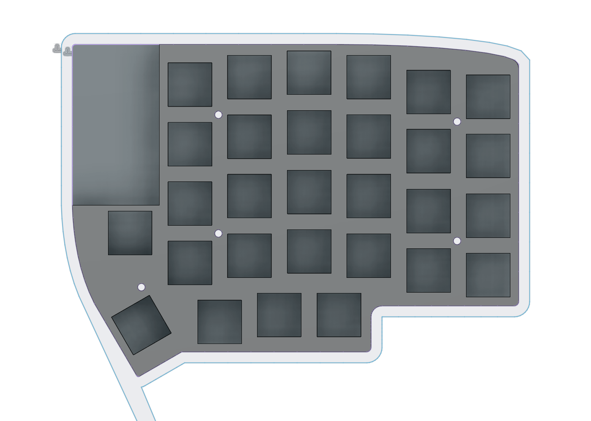

Agent's manual fix: delete the bad curves, replace with a straight 35 mm chord across the thumb apex.

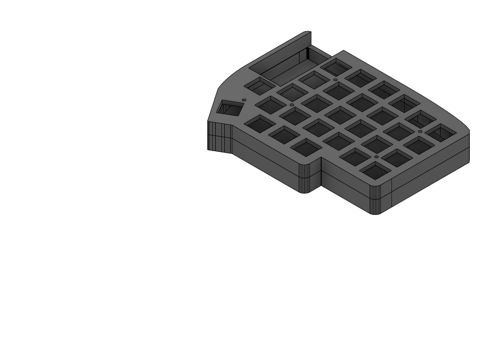

### v3: Bezel with separate switch plate
Then I asked: *"the cutout sits too high, the keycaps can't clear the plate to seat onto the switches."*

Agent doing its calculation: a Cherry MX switch stem rises about 11.6 mm above the PCB, but a fully seated Cherry R3 keycap's skirt sits at about 8.5 mm. My 3 mm plate on 7 mm standoffs put the plate's top surface at 10 mm — high enough to catch the keycap skirt before the keycap could fully bottom out.

Stock Lily58 dodges this because its 1.5 mm acrylic plate lands right at skirt height.

The fix wasn't to lower the plate. The right architecture was:
- **Keep the existing 1.5 mm switch plate** as a separate reference component (stock hardware I already owned)
- **Convert the top plate** into a bezel — a thin rim around the perimeter with a large central opening
- Keys protrude up through the bezel opening; switch plate sits inside at proper height

```
TOP BEZEL          <- 3 mm Al, rim only, walls down to seam
SWITCH PLATE       <- 1.5 mm Al, with cutouts, on 7 mm standoffs (stock)
PCB                <- 1.6 mm, with hot-swap sockets
BOTTOM CASE TUB    <- 3 mm Al, base + 8.6 mm walls
```

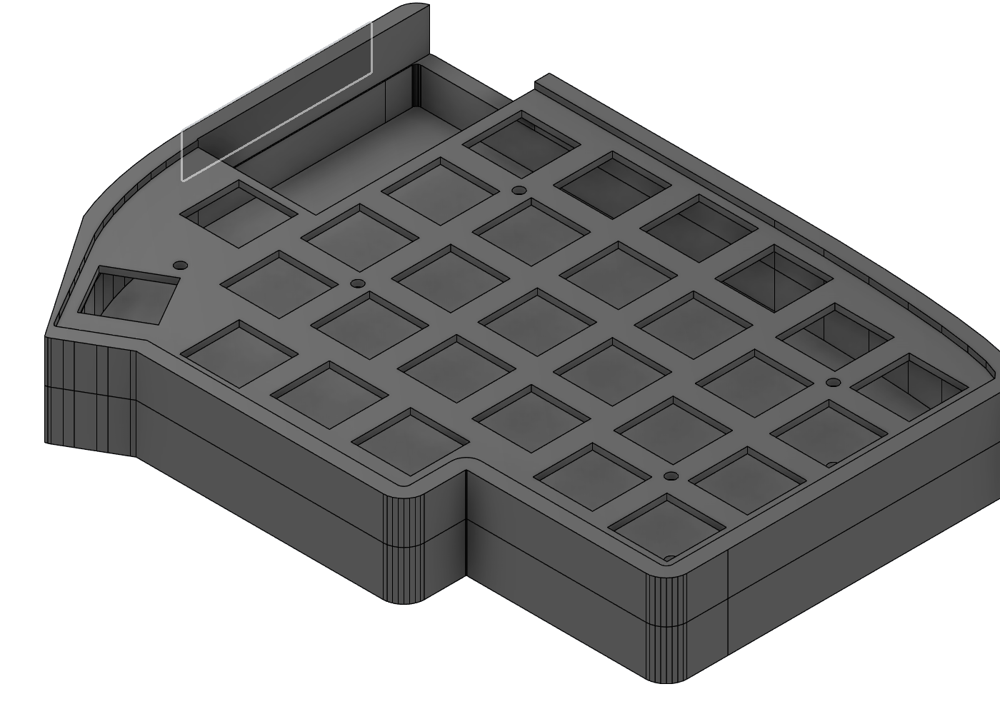

---

## The Chord That Thinned the Bezel

After the bezel rebuild, I noticed: *"The bottom left bezel wall looks thinner compared to the rest."*

That 35 mm straight chord across the thumb apex? It was 1.27 mm too close to the PCB outline at its narrowest point, so the bezel ring (which should be uniform 3.5 mm) thinned to ~2 mm.

The proper offset of a sharp convex corner isn't a chord — it's **two line segments that meet at a point `d / sin(θ/2)` from the original corner**, along the outward bisector. For the thumb apex with ~90° interior angle:

```
offset_apex_distance = 3.5 / sin(45°) = 4.95 mm beyond original apex
```

Agent computed the new apex position by intersecting the two extended offset diagonals, then replaced the chord with a 2-segment V. Ring thickness became uniform again.

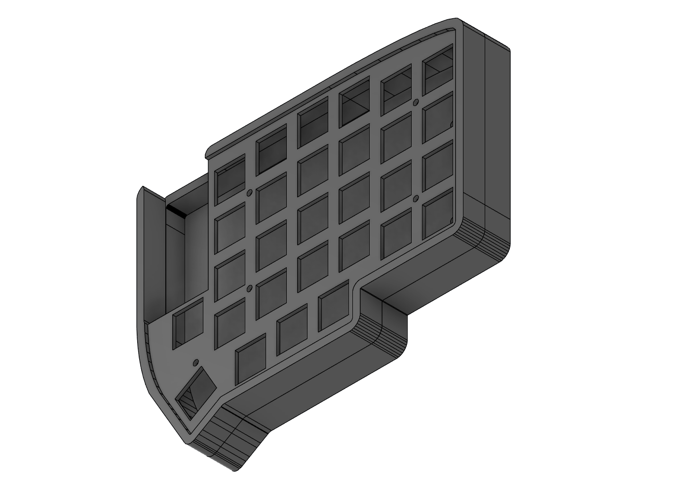

---

## Attaching the Bezel to the Tub

The longest detour in the project. Three full restarts before the screws sat where they were supposed to sit.

### Attempt 1: Magnets + alignment pins (failed)

Agent designed 4 magnet bosses (locally thicker walls to hold 4 mm magnet pockets) plus 2 alignment pins.

Result:
- Bosses extruded as **separate Body 2 and Body 3** instead of joining to the wall
- Magnet pocket cuts cut only the wall (where material existed), creating half-circles
- Alignment pins floated in mid-air, disconnected from the bezel

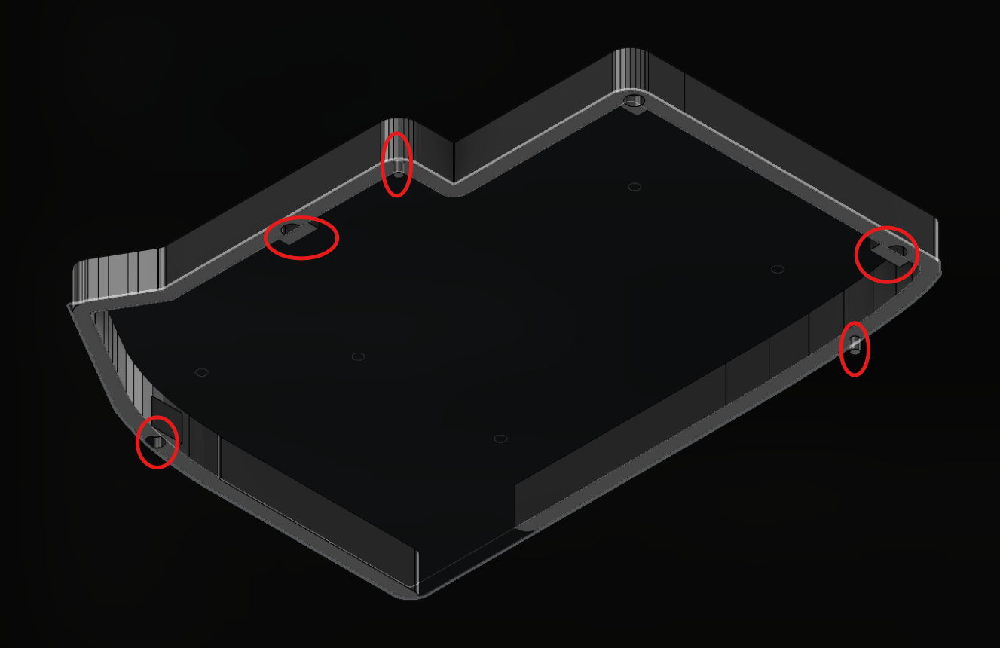

**Root cause**: `JOIN` operation in Fusion needs **volume overlap**, not just a shared face. My boss profiles were placed entirely *inside* the PCB-outline area, with the wall entirely *outside* — they only touched on a 2D line. Fusion treated them as separate disconnected solids.

Same problem hit the alignment pins: Agent extruded them "from Y=0 downward" so they only touched the bezel at the Y=0 plane (zero volume), and they got created as free-floating bodies.

My verdict: *"This is getting complicated. The magnet pockets are misaligned, I can't even fit a magnet in. Pivot to screws."*

Agent deleted all 6 features, 4 sketches, 8 parameters.

### Attempt 2: Top-down edge screws (failed)

M2 SHCS with 3.5 mm head, 3.5 mm wall thickness. Math: zero clearance, head exactly fills wall. Counterbore "destroying the side face."

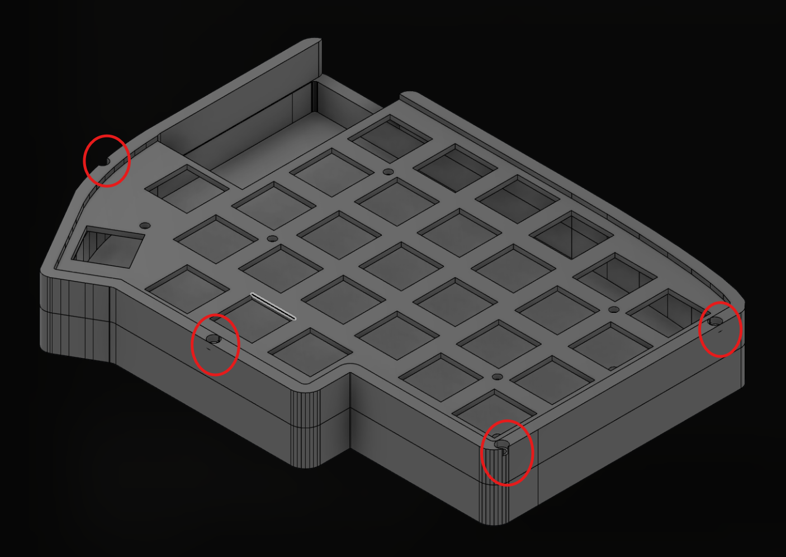

### Attempt 3: Bottom-up edge screws (failed differently)

I pivoted: *"I prefer the screw coming from the bottom. It's not visible from the top, and the screw head diameter isn't limited to the 3.5mm wall thickness."*

Putting the head in the tub *base* (a wide flat plate) drops the wall-thickness constraint entirely — there's room for a 4 mm counterbore in the base without fighting any geometry.

Agent placed screws at the wall's centerline. But the 4 mm counterbore is wider than the 3.5 mm wall it sits over, so it overhung the outer edge by roughly a quarter millimeter. Side face still destroyed.

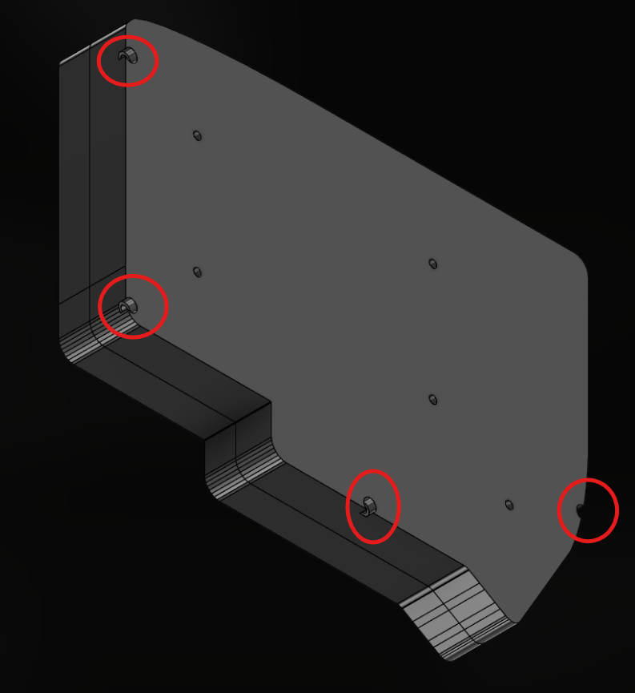

### Attempt 4: Move screws inward, with constraint math

Two competing constraints on the screw axis:
- The 4 mm counterbore in the base must stay inside the outer edge (with 0.2 mm margin). This pulls the screw inward.
- The 2.2 mm clearance hole in the wall must not break into the PCB pocket. This pushes the screw outward.

For a 3.5 mm wall sitting between a sharp outer edge and the PCB pocket, those two inequalities collapsed to **exactly one valid screw axis**. No slack at all. Agent moved the screws there. The right-edge screws fit. S4 fit. But S3 didn't.

### Why S3 failed

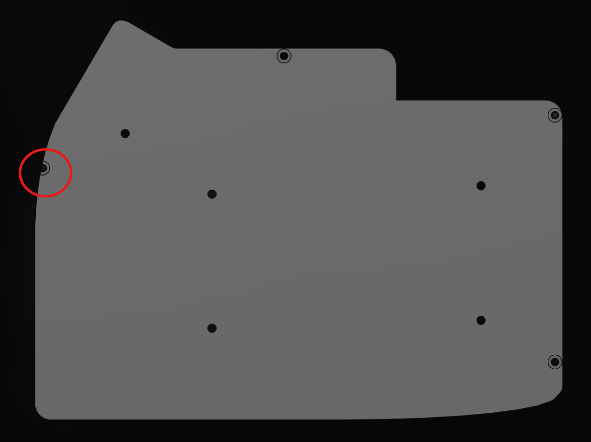

The math said S3 had the same clearance as every other edge screw. Probing the actual outline at S3's location said otherwise — the case edge there sat roughly a millimeter and a half further out than the math assumed, and the counterbore cut straight through it.

Why? The PCB's left edge isn't a straight vertical line. It bends inward partway down as it transitions toward the thumb cluster diagonal, and the offset outline inherits that bend. S3 sat right in the curved region — exactly where "uniform offset distance" stopped being uniform. This is yet  another case of SVG's polyline approximation.

Fix: Agent probed the full left edge, found the section where the offset really did hold straight, and moved S3 into the middle of that section.


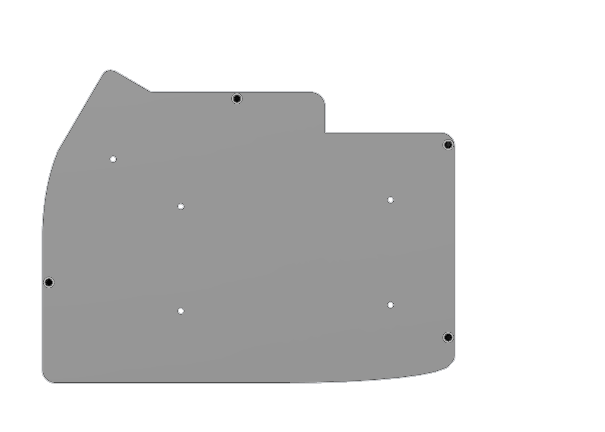

---

## Thread Modeling for Manufacturing

The 4 bezel tap holes started as plain 1.6 mm cylindrical holes. CNC shops will tap from any drilled hole, but **modeled threads carry through to STEP exports** — the helix becomes visible geometry in the file, so the manufacturer reads the thread spec directly from the model without needing a separate drawing callout.

Asked Claude to convert the four holes into internal M2×0.4 threads (ANSI metric profile, class 6H) with the helix actually carved into the model rather than left as a cosmetic annotation. All four holes now show visible thread geometry in the design tree, ready to ship as-is.

---

## Mirroring (and Realizing the Naming Was Backwards)

Agent built the entire design calling it "the left half" for ~30 prompts. When it came time to mirror, I caught the mistake:

> *"Why call it right half for the mirror? Isn't the current design the 'right half'?"*

I was right. Agent certainly assumed that thumb cluster on the **left** means it's the **left** half (???).

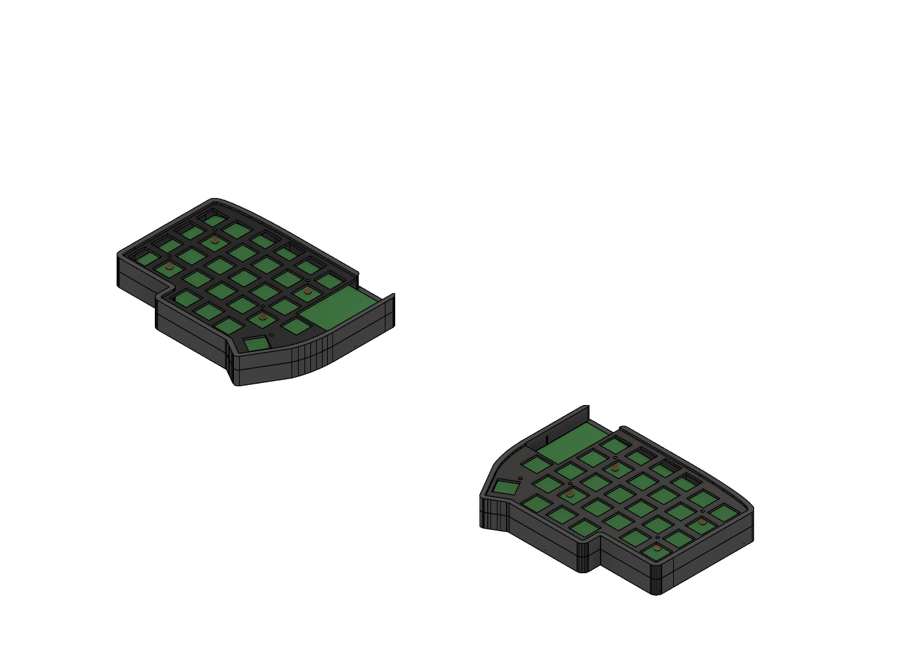

---

## Key Takeaways

- **Don't use SVG.** The single biggest one. Most of the "Lesson" boxes above trace back to SVG's polyline approximation: the 1 µm bridge gaps, the wandering offset curves at the thumb apex, the projected curves that couldn't be filleted or constrained, S3 failing because the offset of a polyline doesn't actually stay a uniform distance from the source. With a format that preserves real arcs and curves end-to-end, most of this post simply doesn't happen.
- **Look at every screenshot and push back on anything that looks wrong.** Almost every restart in this post started with me saying "wait, that's wrong" after seeing a render.
- **Manufacturing-readiness is its own pass after the geometry is correct.** Threads need to be modeled so they carry to STEP exports, counterbores need to fit real screw heads with clearance.
- **Decide architecture before extruding anything.** Separate switch plate vs dual-purpose plate, sandwich vs clamshell, screw vs magnet attachment. I pivoted the plate design at least 3 times because of late architectural changes. Arguably justified for an exploratory project, but a second build wouldn't get that pass.
- **Decide chirality before any geometry exists.** Catching the left/right naming swap after 30 prompts thankfully only cost a rename.

---

## Closing

MCP didn't make CAD easier. What it changed was the bottleneck: less time finding the right tools and clicking dialogs, more time reading screenshots and pushing back. It does, however, lower the entry barrier — anyone already decent at CAD would get the job done faster without it.

Model will be uploaded to GitHub, CNC photos to follow.
